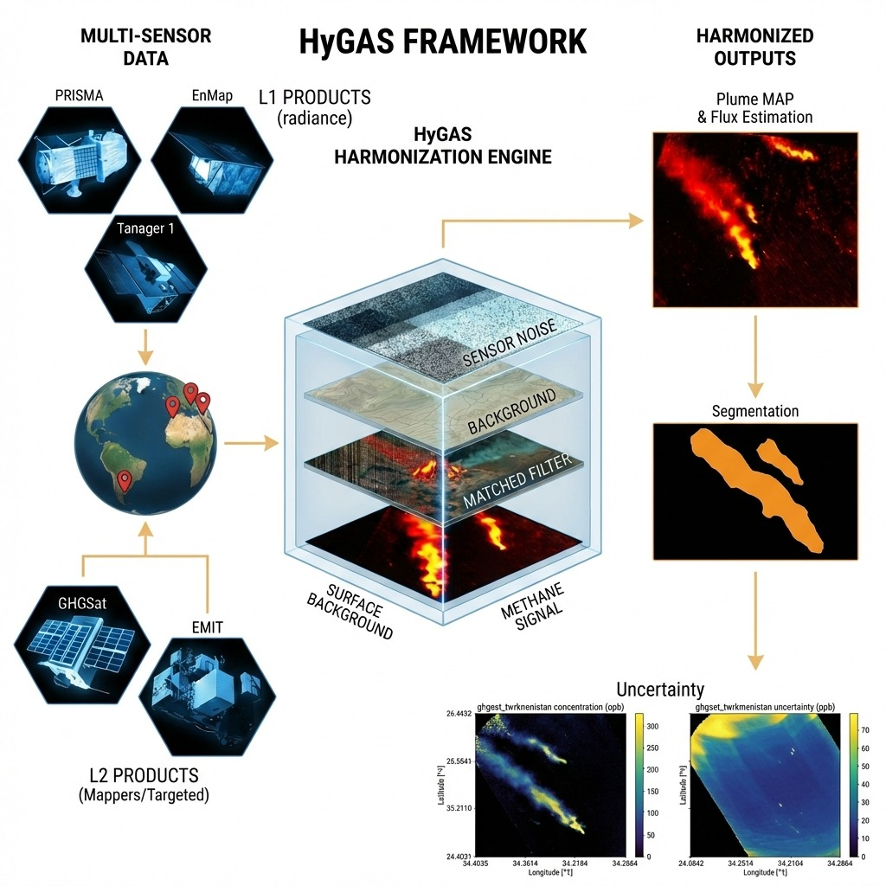

# HyGAS (Hyperspectral Gas Analysis Suite)

<p align="center">
  
</p>

HyGAS is a multi-sensor framework for methane enhancement retrieval (ppm·m), uncertainty propagation, scale-aware plume segmentation, and IME/flux estimation from high-resolution imaging spectrometers.

- End-to-end matched-filter pipelines for **PRISMA**, **EnMAP**, and **Tanager** Level-1 radiances.
- Downstream (segmentation → IME/flux) support for Level-2 enhancement products such as **EMIT** (JPL MF L2B) and **GHGSat** (via notebooks).

## Reference paper (ATBD)

The algorithmic framework implemented here is described in the MDPI *Methane* manuscript:

- **A Multi-Sensor Framework for Methane Detection and Flux Estimation with Scale-Aware Plume Segmentation and Uncertainty Propagation from High-Resolution Spaceborne Imaging Spectrometers**
- Manuscript ID: `methane-4061227`
- Local proof PDF: `product_spec_docs/methane-4061227 - send to 2nd proof_VP_AF.pdf` *(not tracked in git; see `.gitignore`)*

Reproducibility aids:
- `docs/paper-notebook-map.md` maps paper sections/figures/tables to scripts and notebooks.
- `notebooks/README.md` indexes **all** notebooks (excluding `notebooks/to_rev/`).

## Repository Structure

- `scripts/main.py` – unified CLI entry point (PRISMA/EnMAP: scene+batch; Tanager: scene).
- `scripts/pipelines/` – satellite orchestration layers (I/O → MF → σ_RMN → exports).
- `scripts/core/` – shared LUT/targets/MF/noise/report utilities.
- `scripts/satellites/` – satellite adapters/readers (PRISMA/EnMAP/Tanager/EMIT).
- `scripts/plumes_analyzer.py` – IME/flux computation + uncertainty propagation on plume polygons.
- `notebooks/` – analysis notebooks (paper + development).
- `docs/` – paper-to-code mapping and documentation.
- `test_commands.sh` – curated end-to-end command examples (local paths).

## Requirements & Setup

1. Python ≥ 3.11 with GDAL bindings installed (compiled with the same Python).
2. Project dependencies from `requirements-pip.txt`.
3. Access to:
   - PRISMA Level-1/Level-2C HE5 or ZIP archives and a DEM (NetCDF).
   - EnMAP VNIR/SWIR GeoTIFFs with matching METADATA.XML.
   - Tanager radiance HDF5 + surface reflectance HDF5 (for water vapour).
   - Methane LUT (`*.hdf5`) compatible with the matched filter.

Quick start with conda/mamba using the curated environment:

```bash
mamba env create -f environment.min.yml
mamba activate hygas
pip install -r requirements-pip.txt
```

The `environment.min.yml` file pins GDAL/PROJ, PyTorch (CPU build), and the essential scientific stack. If you prefer a lighter setup, you can still create your own environment manually and `pip install -r requirements-pip.txt`, but make sure GDAL is compiled against the same Python interpreter.

Confirm GDAL works by importing `osgeo.gdal` inside the environment before running the pipelines.

## CLI Overview

All executions go through:

```bash
python scripts/main.py --satellite {prisma|enmap|tanager} --mode {scene|batch} [options]
```

Note: `--satellite tanager` currently supports `--mode scene` only.

Global options:

- `--min-wavelength / --max-wavelength` – spectral window (nm) forwarded to both pipelines and included in the processing reports.
- `--k` – number of clusters for k-means based target estimation.
- `--log-file` – optional path to capture INFO-level logs in addition to stdout.
- `--save-rads` – PRISMA only; export the full radiance cube GeoTIFF (disabled by default to avoid multi-GB outputs).
- `--snr-reference` – path to the column-wise SNR reference `.npz` used for σ_RMN propagation and JPL MF. If omitted, the pipelines fall back to `PRISMA_SNR_REFERENCE` / `ENMAP_SNR_REFERENCE` / `TANAGER_SNR_REFERENCE` env vars.

### Matched-filter variant naming (paper ↔ CLI)

The paper uses CMF/CTMF/CWCMF terminology. In the CLI:

- **CMF** (scene-wide) → `--*-mf-mode srf-column --k 1`
- **CTMF (k=3)** → `--*-mf-mode srf-column --k 3`
- **CWCMF** (column-wise) → `--*-mf-mode full-column`

Additional research modes:
- `advanced` (grouped PCA + shrinkage): implemented in `advanced_matched_filter.py`
- `jpl` (JPL/EMIT MF adaptation): implemented in `scripts/core/jpl_matched_filter.py`

## PRISMA Manual

### Single Scene

```bash
python scripts/main.py \
  --satellite prisma --mode scene \
  --l1 /path/to/PRS_L1_STD_OFFL_YYYYMMDDhhmmss_xxxx.he5 \
  --l2c /path/to/PRS_L2C_STD_YYYYMMDDhhmmss_xxxx.he5 \
  --dem /path/to/dem.nc \
  --lut /path/to/dataset_ch4_full.hdf5 \
  --output /path/to/output_dir \
  --min-wavelength 2100 \
  --max-wavelength 2450 \
  --k 1 \
  --prisma-mf-mode srf-column \
  --log-file logs/prisma_scene.log
```

Both `--l1` and `--l2c` accept `.he5` files or ZIP archives. ZIP inputs are unpacked automatically next to the archive, processed, and deleted once the run finishes. When `--output` is omitted the pipeline writes to `<scene_dir>_output`.

`--prisma-mf-mode` mirrors the EnMAP option:

- `srf-column` (default) uses k-means clusters plus column-wise SRF targets (legacy workflow).
- `full-column` skips clustering and derives per-column mean/covariance so the matched filter fully adapts to each detector column.
- `advanced` enables the grouped PCA + shrinkage workflow.
- `jpl` runs the JPL MF adaptation (primarily useful for method comparisons).

### Batch Mode

```bash
python scripts/main.py \
  --satellite prisma --mode batch \
  --root-directory /path/to/prisma_root \
  --dem /path/to/dem.nc \
  --lut /path/to/dataset_ch4_full.hdf5 \
  --output-root /path/to/output_root \
  --min-wavelength 2100 \
  --max-wavelength 2450 \
  --k 1 \
  --prisma-mf-mode full-column \
  --log-file logs/prisma_batch.log
```

The batch driver scans every subfolder under `--root-directory`, pairs L1/L2C (HE5 or ZIP), and mirrors the input structure under `--output-root`. If `--output-root` is omitted, outputs land next to each scene folder (e.g., `20240911... -> 20240911..._output`).

## EnMAP Manual

### Single Scene

```bash
python scripts/main.py \
  --satellite enmap --mode scene \
  --vnir /path/to/...-SPECTRAL_IMAGE_VNIR.TIF \
  --swir /path/to/...-SPECTRAL_IMAGE_SWIR.TIF \
  --metadata /path/to/...-METADATA.XML \
  --lut /path/to/dataset_ch4_full.hdf5 \
  --output /path/to/output_dir \
  --k 1 \
  --min-wavelength 2150 \
  --max-wavelength 2450 \
  --enmap-mf-mode srf-column \
  --log-file logs/enmap_scene.log
```

`--enmap-mf-mode` selects the matched-filter flavor:

- `srf-column` (default) keeps the **MF columnwise SRF with cluster tuning option**, i.e., target spectra are tiled across columns while μ/Σ come from k-means clusters.
- `full-column` activates the true column-wise implementation with per-column mean radiance and covariance (no clustering) so both SRF and statistics adapt to each detector column.
- `advanced` activates the grouped PCA + shrinkage workflow.
- `jpl` runs the JPL MF adaptation (EMIT-style).

### Batch Mode

```bash
python scripts/main.py \
  --satellite enmap --mode batch \
  --root-directory /path/to/enmap_root \
  --lut /path/to/dataset_ch4_full.hdf5 \
  --k 1 \
  --min-wavelength 2150 \
  --max-wavelength 2450 \
  --enmap-mf-mode full-column \
  --log-file logs/enmap_batch.log
```

Each scene directory inside `--root-directory` must contain the VNIR/SWIR GeoTIFFs and the METADATA.XML file. Outputs are written to `<scene>_output` siblings, mirroring the legacy workflow.

## Tanager Manual

Tanager is supported in `--mode scene` only (batch mode is not implemented in `scripts/main.py`).

```bash
python scripts/main.py \
  --satellite tanager --mode scene \
  --tanager-rad /path/to/basic_radiance.h5 \
  --tanager-sr /path/to/surface_reflectance.h5 \
  --dem /path/to/dem.nc \
  --lut /path/to/dataset_ch4_full.hdf5 \
  --snr-reference /path/to/snr_reference_columnwise.npz \
  --output /path/to/output_dir \
  --min-wavelength 2100 \
  --max-wavelength 2450 \
  --k 1 \
  --tanager-mf-mode full-column \
  --log-file logs/tanager_scene.log
```

## Outputs & Reporting

Every run produces a set of GeoTIFFs plus a text report under the chosen output directory:

- `*_MF*.tif` – methane enhancement / matched-filter output (ΔX in ppm·m).
- `*_MF_uncertainty.tif` – propagated instrument-noise uncertainty (σ_RMN).
- `*_MF_sensitivity.tif` – sensitivity map (only for `--*-mf-mode jpl`).
- `*_RGB.tif` or `*_rgb.tif` – quick-look RGB composite (sensor-specific naming).
- `*_CL.tif` or `*_classified.tif` – classified result (sensor-specific naming).
- `processing_report.txt` – provenance summary (inputs, parameters, spectral window, statistics).

PRISMA batch runs also emit `directory_process_report_<timestamp>.txt` summarizing successes/failures per scene.

## Logging & Diagnostics

- STDOUT always receives INFO logs; use `--log-file path.log` to keep a copy.
- Temporary PRISMA extractions are cleaned automatically; failures to delete are logged as warnings.
- For quick local validation, run the commands stored in `test_commands.sh` (paths assume the `test_data/` bundle under the repo).

## Tips & Troubleshooting

- DEM files are mandatory for PRISMA but ignored for EnMAP.
- When processing ZIP archives, ensure each contains exactly one `.he5` file; otherwise the CLI aborts with a clear error.
- If you see `Missing required ... arguments` revisit the per-mode required options listed above.
- Spectral window and `k` parameters are persisted in the processing report—helpful when comparing runs.

The legacy `scripts/PRISMA/prisma_MF.py` and `scripts/EnMAP/enmap_MF.py` remain callable for backwards compatibility but simply forward into the new CLI. Prefer `scripts/main.py` for all new runs.

## Scripts (diagnostics & utilities)

Beyond the end-to-end pipelines, the repo ships lightweight analysis scripts used by the paper notebooks and for development/validation:

- Pipelines:
  - `scripts/main.py` – main entrypoint (PRISMA/EnMAP batch + scene; Tanager scene).
  - `scripts/run_enmap_case_studies.py`, `scripts/run_prisma_case_studies.py`, `scripts/run_tanager_case_studies.py` – run predefined case studies across multiple MF modes.
- Radiometry (SNR / smile / striping):
  - `scripts/snr_experiment.py` – consolidated A–H SNR experiment CLI (PRISMA/EnMAP/Tanager/EMIT radiance inputs).
  - `scripts/enmap_smile.py`, `scripts/prisma_smile.py` – spectral smile diagnostics (CW/FWHM, Δλ).
  - `scripts/diagnostics/striping.py` – striping metrics + light destriping primitives (used by SNR/striping notebooks).
  - `scripts/SNR_enmap.py`, `scripts/SNR_prisma.py` – standalone SNR estimators (legacy but still useful for quick plotting).
  - `scripts/SNR_tanager_reference.py` – generates a `ColumnwiseSNRReference` (`.npz`) for Tanager.
- Plume products (IME / flux):
  - `scripts/plumes_analyzer.py` – IME and flux estimation on plume polygons + uncertainty propagation.
- Data inspection / helpers:
  - `scripts/inspect_prisma_hdf.py` – explore PRISMA HE5/ZIP structure from the terminal.
  - `scripts/inspect_tanager_hdf.py` – explore Tanager HDF5/ZIP structure from the terminal.
  - `scripts/tanager_quicklook.py` – build a quick RGB preview from Tanager TOA radiance.
  - `scripts/ghgsat_catalog_to_geojson.py` – convert a GHGSat catalog CSV export to GeoJSON (points + buffers).

Run utilities from the repo root so imports resolve, e.g.:

```bash
PYTHONPATH=. python scripts/enmap_smile.py --help  # edit the __main__ block for your scene paths
PYTHONPATH=. python scripts/SNR_prisma.py
```

The four plotting-oriented utilities share the same 3×2 layout and rely on the existing `prisma_utils.py` / `enmap_utils.py` readers, so any improvements to the satellite helpers automatically benefit both the operational pipelines and these diagnostics.

## Notebooks (paper)

Only the notebooks used for the `methane-4061227` paper are listed here. For a complete notebook index (excluding ongoing work in `notebooks/to_rev/`), see `notebooks/README.md`.

- `notebooks/ch4_radiance_windows.ipynb`
- `notebooks/diagnostics_uncertainty_enmap.ipynb`
- `notebooks/diagnostics_uncertainty_prisma.ipynb`
- `notebooks/plume_analysis_enmap.ipynb`
- `notebooks/SNR_experiments_enmap.ipynb`
- `notebooks/SNR_experiments_prisma.ipynb`
- `notebooks/SNR_experiments_tanager.ipynb`
- `notebooks/tanager_prisma_enmap_SNR_comparison.ipynb`
- `notebooks/striping_sweep_diagnostics_cal_scenes_triple.ipynb`
- `notebooks/BA_plume_detection_scaled.ipynb`
- `notebooks/BA_plume_analysis_enmap_ghgsat_emit.ipynb`
- `notebooks/Turkmenistan_plume_detection_scaled.ipynb`
- `notebooks/Turkmenistan_plume_analysis_enmap_prisma_ghgsat.ipynb`
- `notebooks/Pakistan_plume_detection_scaled.ipynb`
- `notebooks/Pakistan_plume_analysis_emit_ghgsat.ipynb`
- `notebooks/BA2_plume_detection_single_MF.ipynb`
- `notebooks/BA2_plume_analysis_single_MF.ipynb`

## PRISMA HDF Exploration

Use `scripts/inspect_prisma_hdf.py` to explore the hierarchy of a Level-1 or Level-2C PRISMA product without leaving the terminal. The tool accepts both `.he5` files and the official ZIP archives, automatically extracting the embedded HE5 to a temporary directory when needed.

- Tree view (optionally capped by depth and including attributes):

  ```bash
  python scripts/inspect_prisma_hdf.py \
    test_data/prisma/20240911071151/PRS_L2C_STD_20240911071151_20240911071155_0001.zip \
    --max-depth 2 --attrs
  ```

- Focus on a specific dataset or group with a quick preview of numeric values:

  ```bash
  python scripts/inspect_prisma_hdf.py \
    test_data/prisma/20240911071151/PRS_L2C_STD_20240911071151_20240911071155_0001.zip \
    --path "HDFEOS/SWATHS/PRS_L2C_WVM/Data Fields/WVM_Map" \
    --preview 5 --attrs
  ```

Append `--output /path/to/report.txt` to save the listing to disk in addition to printing it on screen. `--path` accepts any HDF dataset/group path, `--preview` limits how many numeric values are sampled (the script only reads a thin block to avoid loading whole cubes), and `--max-members` caps how many children are listed when inspecting a group.

## Tanager HDF Exploration

Two small utilities help verify Planet Tanager Basic/Ortho HDF5 deliveries (see `product_spec_docs/tanager/Planet-UserDocumentation-Tanager.pdf` for the field definitions).

- Inspect hierarchy or a specific dataset/attribute (ZIP inputs are unpacked automatically):

  ```bash
  python scripts/inspect_tanager_hdf.py /path/to/tanager_scene.h5 --max-depth 2 --attrs
  python scripts/inspect_tanager_hdf.py /path/to/tanager_scene.zip --path "HDFEOS/SWATHS/HYP/Data Fields/toa_radiance" --preview 8
  ```

- Build a quick RGB preview from the TOA radiance cube (auto-selects 665/565/490 nm bands and applies a 2–98% stretch):

  ```bash
  python scripts/tanager_quicklook.py /path/to/tanager_scene.h5 --summary --output outputs/tanager_rgb.png
  ```

Use `--rgb-wavelengths`, `--stretch`, or `--gamma` to tweak the quicklook rendering, `--pixel r c` to print a per-pixel spectrum, and `--no-mask` to skip applying the `nodata_pixels` mask when deriving RGB.
