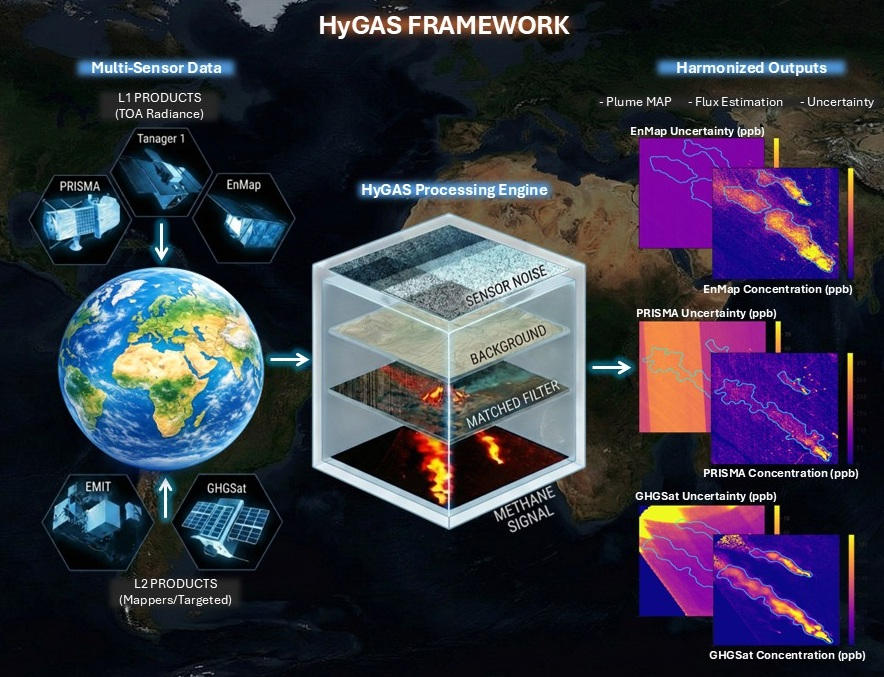

# HyGAS (Hyperspectral Gas Analysis Suite)

<p align="center">
  
</p>

HyGAS is an open-source framework for analysing gas plumes from imaging spectroscopy. Its published, validated workflow is for **methane (CH₄)**: it retrieves path-integrated enhancements (ΔX, **ppm·m**) from Level-1 radiances, characterises uncertainty, and supports consistent plume segmentation, Integrated Mass Enhancement (IME), and flux analysis across multiple satellite products.

The graphical abstract above is the published visual summary of the HyGAS CH₄ framework. The repository also contains an **experimental Tanager-1 CO₂ retrieval**; its scope and current limitations are stated explicitly below.

## What HyGAS supports

| Input / sensor | Gas | Entry point | Retrieval outputs | Common plume analysis | Status |
| --- | --- | --- | --- | --- | --- |
| PRISMA Level-1 + L2C | CH₄ | CLI, scene or batch | ΔX, instrument uncertainty (`σ_RMN`), class map, RGB | Yes, through analysis notebooks | Published workflow |
| EnMAP Level-1B radiances | CH₄ | CLI, scene or batch | ΔX, `σ_RMN`, class map, RGB | Yes, through analysis notebooks | Published workflow |
| Tanager-1 Basic radiance + surface reflectance | CH₄ | CLI, scene | ΔX, `σ_RMN`, class map, RGB | Yes, through analysis notebooks | Published workflow |
| EMIT Level-2B CH₄ enhancement | CH₄ | Analysis notebooks | Provider ΔX and uncertainty are ingested | Yes | Published downstream workflow |
| GHGSat Level-2 CH₄ product | CH₄ | Analysis notebooks | Provider ΔX and uncertainty are ingested | Yes | Published downstream workflow |
| Tanager-1 Basic radiance + surface reflectance | CO₂ | CLI, scene | ΔX, `σ_RMN`, class map, RGB | **No** | Experimental retrieval path |

`σ_RMN` is propagated instrument-noise uncertainty. The background/clutter term (`σ_surf`), total uncertainty (`σ_tot`), segmentation, IME, and flux steps are the **downstream scientific-analysis workflow** used by the case-study notebooks; they are not produced by the retrieval CLI alone.

## How the CH₄ framework works

HyGAS uses the same physical and statistical chain for Level-1 CH₄ retrievals from PRISMA, EnMAP, and Tanager-1:

1. A scene-specific, LUT-derived radiance target represents a 1 ppm·m CH₄ enhancement, including the sensor spectral response.
2. A matched filter estimates a ΔX map and propagates radiometric noise into a per-pixel `σ_RMN` map.
3. Semi-automatic, scale-aware segmentation defines comparable plume masks at each sensor's native resolution.
4. Plume-free pixels with continuum spectra similar to the background beneath each mask are selected to estimate surface/background clutter (`σ_surf`); it combines with `σ_RMN` to form `σ_tot`.
5. The common IME and effective-wind formulation yields plume mass, flux, and their uncertainty.

### CH₄ uncertainty treatment

For PRISMA, EnMAP, and Tanager-1 Level-1 retrievals, HyGAS first propagates the sensor's radiometric noise through the matched filter to obtain the per-pixel instrument term `σ_RMN`. It then estimates a scene-level clutter term, `σ_surf`, from matched-filter variability over plume-free pixels selected for their continuum spectral similarity to the background beneath the plume. The background-aware uncertainty is calculated per pixel as `σ_tot = √(σ_RMN² + σ_surf²)` and is propagated to IME and flux in the downstream analysis. This separates detector/radiometric precision from surface-driven and residual background variability.

For the complete uncertainty ATBD—noise model, spectrally matched-background selection, assumptions, and propagation to IME and flux—refer to the published paper and the [paper-to-code map](docs/paper-notebook-map.md). EMIT and GHGSat use their provider-derived Level-2 uncertainty fields in the downstream HyGAS workflow. The paper is about **CH₄**; it does not validate the repository's later CO₂ extension.

### Reference SNR used for `σ_RMN`

The Level-1 uncertainty workflow uses a column-wise reference SNR rather than a single mission-wide number. Each reference is derived from a bright, spatially homogeneous, methane-free desert calibration scene (a Pseudo-Invariant Calibration Site), chosen so that residual spatial variation is dominated by detector behaviour rather than surface structure:

- **PRISMA:** `L1-20200401T085313`, Northern State, Sudan.
- **EnMAP:** `L1B-20220712T104302`, near Agadez, Niger.
- **Tanager-1:** `20250509_090323_87_4001`, Northern State, Sudan; the homogeneous upper 220 image rows are selected before estimating the reference.

For every spectral band and detector column, HyGAS calculates the mean radiance and uses the standard deviation of the fourth principal component as the measurement-noise estimate. The reference is `SNR_ref(λ,c) = μ(λ,c) / σ_MN(λ,c)`. For a target scene, SNR is scaled column-wise with radiance under the photon-noise approximation, `SNR(λ,c;L) ≈ SNR_ref(λ,c) √(L(λ,c) / L_ref(λ,c))`; the resulting noise covariance is propagated analytically through the matched filter to produce `σ_RMN`.

The reference-generation and sensitivity experiments are reproducible in the [PRISMA](notebooks/SNR_experiments_prisma.ipynb), [EnMAP](notebooks/SNR_experiments_enmap.ipynb), and [Tanager-1](notebooks/SNR_experiments_tanager.ipynb) notebooks. The [Tanager calibration-selection notebook](notebooks/tanager_calibration_selection.ipynb) documents the homogeneous-row selection; [cross-sensor SNR comparison](notebooks/tanager_prisma_enmap_SNR_comparison.ipynb) provides brightness-normalised comparisons. See the reference paper for the complete radiometric-noise ATBD and its limitations.

## Common HyGAS workflow

HyGAS currently combines **automated retrieval** with **notebook-guided plume analysis**. The CLI is suitable for repeatable single-scene and, where supported, batch retrievals; the final plume masks, total-uncertainty derivation, and IME/flux products are produced through the example notebooks so that image-specific statistics and quality-control choices remain visible and reproducible.

1. **Prepare the input product.** Use a Level-1 radiance product for PRISMA, EnMAP, or Tanager-1, with the required LUT, DEM where applicable, and SNR reference. For EMIT and GHGSat, begin from the provider's Level-2 CH₄ enhancement and uncertainty fields.
2. **Run or ingest the CH₄ retrieval.** Run `scripts/main.py` for Level-1 scenes to create ΔX and `σ_RMN` rasters, or load Level-2 products in the relevant analysis notebook. Select and record the matched-filter configuration; use multiple configurations when assessing retrieval sensitivity.
3. **Define the analysis domain.** Inspect the enhancement and uncertainty maps. For a multi-sensor comparison, clip every image to the common footprint before calculating segmentation statistics.
4. **Segment plumes semi-automatically.** In the case-study notebook, choose the threshold multiplier and physical morphology settings. The notebook calculates robust background statistics separately for every clipped image, converts the shared physical settings to each sensor's pixel grid, and creates candidate masks. Review the masks, remove implausible isolated objects, and merge fragments belonging to the same source and wind-aligned plume where needed.
5. **Derive total uncertainty.** Use the reviewed plume mask to select spectrally matched, plume-free background pixels. For Level-1 HyGAS retrievals, derive `σ_surf` and combine it with `σ_RMN` to produce `σ_tot`; for Level-2 products, use the uncertainty treatment supplied and documented for that product.
6. **Calculate and report IME and flux.** Provide the final plume polygons and the selected wind input (including its uncertainty) to the IME/flux workflow. Report ΔX statistics, plume area, IME and `σ_IME`, flux and `σ_flux`, together with the retrieval, segmentation, and wind settings.

This is intentionally not a one-click plume-to-flux batch processor yet: the notebook stage exposes the scene-dependent choices that most affect plume extent and quantitative uncertainty. The [notebook index](notebooks/README.md) and the case studies linked below provide executable examples of this workflow.

## Multi-sensor consistency

For each matchup, HyGAS clips all enhancement maps to their shared footprint, then runs the same downstream IME and flux workflow. The plume segmentation is **semi-automatic**:

- For every sensor image, robust background statistics (`μ_bg` and `σ_bg`) are calculated independently from that image's clipped enhancement map. Candidate plume pixels are selected with the same statistical rule, `ΔX > μ_bg + n·σ_bg`.
- Smoothing, morphology, maximum gap, and minimum plume area are defined once in physical units. They are converted to pixel units using each sensor's ground sampling distance, so the geometric criteria remain comparable at different resolutions.
- Connected components and morphological filtering create the initial masks. A final review discards isolated structures inconsistent with the prevailing wind direction and can merge adjacent fragments that share a source and advective direction.

This preserves image-specific background behaviour while applying common physical segmentation criteria. The resulting masks feed the same IME and effective-wind flux equations. For Level-1 PRISMA, EnMAP, and Tanager-1 products, HyGAS also separates instrument noise from spectrally matched background clutter; EMIT and GHGSat enter with provider-derived Level-2 enhancement and uncertainty fields.

The published examples are:

- [Buenos Aires: EnMAP, EMIT, and GHGSat](notebooks/BA_plume_detection_scaled.ipynb) with [IME/flux analysis](notebooks/BA_plume_analysis_enmap_ghgsat_emit.ipynb)
- [Turkmenistan: PRISMA, EnMAP, and GHGSat](notebooks/Turkmenistan_plume_detection_scaled.ipynb) with [IME/flux analysis](notebooks/Turkmenistan_plume_analysis_enmap_prisma_ghgsat.ipynb)
- [Pakistan: EMIT and GHGSat](notebooks/Pakistan_plume_detection_scaled.ipynb) with [IME/flux analysis](notebooks/Pakistan_plume_analysis_emit_ghgsat.ipynb)
- [EnMAP and Tanager-1 revisit comparison](notebooks/BA2_plume_detection_single_MF.ipynb) with [IME/flux analysis](notebooks/BA2_plume_analysis_single_MF.ipynb)

## Reference paper

The CH₄ framework implemented here is described in:

Ferrari, A.; Pampanoni, V.; Laneve, G.; Carvajal Tellez, R.A.; Saquella, S. *A Multi-Sensor Framework for Methane Detection and Flux Estimation with Scale-Aware Plume Segmentation and Uncertainty Propagation from High-Resolution Spaceborne Imaging Spectrometers*. **Methane** 2026, 5(1), 10. DOI: [10.3390/methane5010010](https://doi.org/10.3390/methane5010010).

The exact relationship between paper sections, figures, code, and notebooks is documented in [docs/paper-notebook-map.md](docs/paper-notebook-map.md).

## Installation and inputs

HyGAS requires Python 3.11 or later and GDAL bindings compiled for the same Python interpreter. Create the curated environment with:

```bash
mamba env create -f environment.min.yml
mamba activate hygas
pip install -r requirements-pip.txt
```

Confirm that `from osgeo import gdal` works before running a pipeline.

You will need the following data, as applicable:

- PRISMA Level-1 and Level-2C HE5 files (or official ZIP archives).
- EnMAP VNIR/SWIR GeoTIFFs with their matching `METADATA.XML`.
- Tanager Basic radiance and companion surface-reflectance HDF5 products.
- A CH₄ LUT, `dataset_ch4_full.hdf5`, from the [University of Utah HIVE dataset](https://hive.utah.edu/concern/datasets/9w0323039) (or the [repository mirror](https://drive.google.com/file/d/196adGp_XCcTXAk3SRjiOnBJxUhDANNvn/view?usp=sharing)). Please cite Foote et al., *Impact of Scene-Specific Enhancement Spectra on Matched Filter GreenhouseGas Retrievals from Imaging Spectroscopy*.
- A DEM NetCDF file for PRISMA and Tanager. It must provide `lat`, `lon`, and `elev` in metres; the [SRTM30 Global 1 km DEM](https://catalog.data.gov/dataset/srtm30-global-1-km-digital-elevation-model-dem-version-11-land-surface) is one suitable source.
- A column-wise SNR-reference `.npz` for uncertainty propagation. Pass `--snr-reference` or set `PRISMA_SNR_REFERENCE`, `ENMAP_SNR_REFERENCE`, or `TANAGER_SNR_REFERENCE`.
- For the CO₂ path only, a compatible `dataset_co2_full.hdf5` LUT with the same `modtran_data`, `modtran_param`, and `wave` structure as the CH₄ LUT.

## Retrieval quick start

All retrievals use the unified entry point:

```bash
python scripts/main.py --satellite {prisma|enmap|tanager} --mode {scene|batch} --lut /path/to/lut.hdf5 [options]
```

Tanager currently supports `--mode scene` only. PRISMA and EnMAP accept both scene and batch modes.

Common options are `--min-wavelength` / `--max-wavelength` (spectral window), `--k` (cluster count for `srf-column`), `--snr-reference` (or its sensor-specific environment-variable fallback), and `--log-file`. `--save-rads` additionally exports the full PRISMA radiance cube and is intentionally unavailable for the other sensors.

### CH₄: EnMAP single scene

```bash
python scripts/main.py \
  --satellite enmap --mode scene \
  --vnir /path/to/...-SPECTRAL_IMAGE_VNIR.TIF \
  --swir /path/to/...-SPECTRAL_IMAGE_SWIR.TIF \
  --metadata /path/to/...-METADATA.XML \
  --lut /path/to/dataset_ch4_full.hdf5 \
  --snr-reference /path/to/snr_reference_columnwise.npz \
  --output /path/to/output_dir \
  --enmap-mf-mode full-column
```

The default CH₄ window is 2100–2450 nm. Use `--min-wavelength` and `--max-wavelength` to override it.

### CO₂: Tanager single scene

```bash
python scripts/main.py \
  --satellite tanager --mode scene --gas co2 \
  --tanager-rad /path/to/basic_radiance.h5 \
  --tanager-sr /path/to/surface_reflectance.h5 \
  --dem /path/to/dem.nc \
  --lut /path/to/dataset_co2_full.hdf5 \
  --snr-reference /path/to/snr_reference_columnwise.npz \
  --output /path/to/output_dir \
  --tanager-mf-mode full-column
```

CO₂ defaults to 1900–2100 nm. This path has been exercised on the Tanager-1 Korba/Kusmunda scene (`20250219_053251_31_4001`) with 40 selected bands, but it is an engineering test of data loading, target synthesis, uncertainty propagation, and export—not a validation of CO₂ plume detection or retrieved magnitude.

## Matched-filter modes

| Paper term | CLI selection | Intended use |
| --- | --- | --- |
| CMF (scene-wide) | `--*-mf-mode srf-column --k 1` | Scene-wide background statistics with column-wise targets |
| CTMF (k = 3) | `--*-mf-mode srf-column --k 3` | Cluster-tuned background statistics |
| CWCMF (column-wise) | `--*-mf-mode full-column` | Per-detector-column target/statistics; `--k` is ignored |

`advanced` (grouped PCA plus shrinkage) and `jpl` (JPL/EMIT-style adaptation) are additional research modes. The CLI default is `srf-column`; in the published multi-sensor CH₄ case studies, **CWCMF / `full-column`** was the primary reference configuration because it most consistently reduced detector-column artefacts and stabilised IME/flux estimates.

## Sensor-specific commands

### PRISMA

```bash
python scripts/main.py \
  --satellite prisma --mode scene \
  --l1 /path/to/PRS_L1_STD_OFFL_YYYYMMDDhhmmss_xxxx.he5 \
  --l2c /path/to/PRS_L2C_STD_YYYYMMDDhhmmss_xxxx.he5 \
  --dem /path/to/dem.nc \
  --lut /path/to/dataset_ch4_full.hdf5 \
  --snr-reference /path/to/snr_reference_columnwise.npz \
  --output /path/to/output_dir \
  --prisma-mf-mode full-column
```

PRISMA accepts HE5 files or official ZIP archives. Batch mode scans scene folders under `--root-directory` and writes a corresponding output tree under `--output-root` (or adjacent to each input scene when omitted).

```bash
python scripts/main.py \
  --satellite prisma --mode batch \
  --root-directory /path/to/prisma_root \
  --dem /path/to/dem.nc \
  --lut /path/to/dataset_ch4_full.hdf5 \
  --snr-reference /path/to/snr_reference_columnwise.npz \
  --output-root /path/to/output_root \
  --prisma-mf-mode full-column
```

### EnMAP

```bash
python scripts/main.py \
  --satellite enmap --mode batch \
  --root-directory /path/to/enmap_root \
  --lut /path/to/dataset_ch4_full.hdf5 \
  --snr-reference /path/to/snr_reference_columnwise.npz \
  --enmap-mf-mode full-column
```

Each EnMAP scene directory must contain its VNIR and SWIR GeoTIFFs and `METADATA.XML`. Scene mode is shown in the quick-start example above.

### Tanager-1 CH₄

```bash
python scripts/main.py \
  --satellite tanager --mode scene \
  --tanager-rad /path/to/basic_radiance.h5 \
  --tanager-sr /path/to/surface_reflectance.h5 \
  --dem /path/to/dem.nc \
  --lut /path/to/dataset_ch4_full.hdf5 \
  --snr-reference /path/to/snr_reference_columnwise.npz \
  --output /path/to/output_dir \
  --tanager-mf-mode full-column
```

## Retrieval outputs and scope

Each CLI retrieval writes sensor-specific GeoTIFF names under the output directory:

| Output | Meaning |
| --- | --- |
| `*_MF.tif` | Matched-filter gas enhancement, ΔX (ppm·m) |
| `*_MF_uncertainty.tif` | Propagated instrument-noise uncertainty, `σ_RMN` |
| `*_CL.tif` / `*_classified.tif` | Technical classification map used by the selected MF mode |
| `*_RGB.tif` / `*_rgb.tif` | RGB quicklook |
| `*_MF_sensitivity.tif` | Sensitivity map exported by `jpl` mode for PRISMA and EnMAP |
| `processing_report.txt` | Inputs, parameters, spectral window, and processing provenance |

PRISMA batch runs also create a `directory_process_report_<timestamp>.txt` summary. `*_MF_uncertainty.tif` is **not** a total plume-analysis uncertainty: it excludes the spectrally matched clutter term, segmentation effects, and flux/wind contributions.

### CO₂ limitations

The CO₂ implementation is limited to Tanager scene retrieval. It creates the same four basic retrieval outputs (ΔX, `σ_RMN`, classification, RGB), but currently does **not** implement CO₂ background-clutter quantification, `σ_tot`, scale-aware segmentation, IME, flux, or validation against an independent CO₂ reference. Do not treat its output as a quantitatively validated CO₂ plume product.

## Notebooks and examples

The paper notebook index is in [notebooks/README.md](notebooks/README.md). Useful entry points are:

- [CH₄ radiance windows and LUT targets](notebooks/ch4_radiance_windows.ipynb)
- [EnMAP uncertainty walkthrough](notebooks/diagnostics_uncertainty_enmap.ipynb)
- [PRISMA uncertainty walkthrough](notebooks/diagnostics_uncertainty_prisma.ipynb)
- [Spectrally matched background selection](notebooks/plume_analysis_enmap.ipynb)
- [PRISMA, EnMAP, and Tanager SNR experiments](notebooks/SNR_experiments_prisma.ipynb), [EnMAP](notebooks/SNR_experiments_enmap.ipynb), and [Tanager](notebooks/SNR_experiments_tanager.ipynb)
- [Cross-sensor SNR comparison](notebooks/tanager_prisma_enmap_SNR_comparison.ipynb) and [striping diagnostics](notebooks/striping_sweep_diagnostics_cal_scenes_triple.ipynb)

Notebook outputs are deliberately excluded from version control. When adding a new README example figure, create a clean, captioned, unit-checked derivative under `docs/assets/` rather than linking directly to `notebooks/outputs/`.

## Utilities and troubleshooting

- `scripts/snr_experiment.py` runs the A–H SNR experiment for PRISMA, EnMAP, Tanager, or EMIT inputs.
- `scripts/enmap_smile.py` and `scripts/prisma_smile.py` provide spectral-smile diagnostics.
- `scripts/plumes_analyzer.py` computes IME, flux, and uncertainty on supplied plume polygons.
- `scripts/inspect_prisma_hdf.py` and `scripts/inspect_tanager_hdf.py` inspect product structures; `scripts/tanager_quicklook.py` creates an RGB preview.
- `scripts/ghgsat_catalog_to_geojson.py` converts GHGSat catalogue CSV exports to point/buffer GeoJSON.

Run utilities from the repository root. The legacy `scripts/PRISMA/prisma_MF.py` and `scripts/EnMAP/enmap_MF.py` entry points remain for backwards compatibility, but new retrievals should use `scripts/main.py`.

If a pipeline reports missing required inputs, check the sensor-specific command above. PRISMA and Tanager require a DEM; EnMAP ignores it. Record the chosen spectral window, MF mode, SNR reference, and `k` when comparing products.

## Repository layout

- `scripts/main.py` — unified retrieval CLI.
- `scripts/pipelines/` — PRISMA, EnMAP, and Tanager orchestration.
- `scripts/core/` — LUT, targets, matched filters, noise, and reporting utilities.
- `scripts/satellites/` — sensor readers and adapters.
- `scripts/plumes_analyzer.py` — downstream IME/flux utilities.
- `notebooks/` — published-workflow and development notebooks.
- `docs/paper-notebook-map.md` — paper section/figure to implementation mapping.

## License

See [LICENSE](LICENSE).
